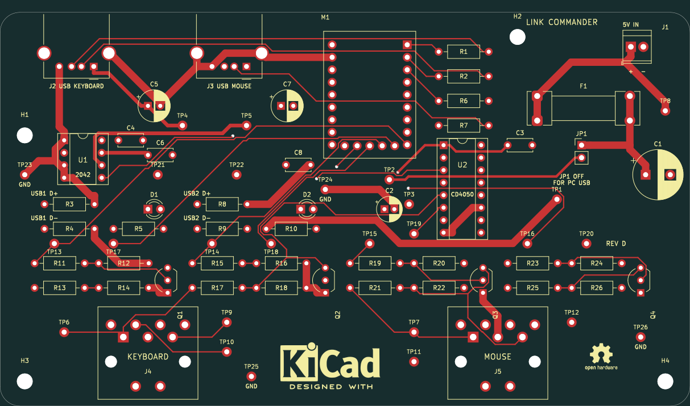

# LINK COMMANDER — Rev D

**Buy the breadboard parts:** [Amazon checklist + ASINs](SHOPPING-AMAZON.md) · [Mouser checklist + SKUs](SHOPPING-MOUSER.md) · [Amazon order CSV](SHOPPING-AMAZON-ORDER.csv) · [Full Mouser CSV](SHOPPING-MOUSER-ORDER.csv) · [Keyboard-only Mouser CSV](SHOPPING-MOUSER-KEYBOARD.csv). Choose one checklist; do not buy both. Each covers the build and explicitly identifies outside-store exceptions. Skip parts already owned.

A through-hole USB keyboard and mouse adapter for the **Commander X16**.
The RP2040-Zero translates supported wired devices or 2.4 GHz USB receivers
into PS/2 keyboard and mouse signals. Rev D removes all gamepad support.

**Two USB inputs. Two PCB-mounted 7-pin DIN outputs. Two socketed DIP chips.**
The RP2040-Zero plugs into removable headers; every other carrier part is
through-hole. No USB hub or onboard radio is required.

A separate regulated **5 V / 2 A supply** powers the module and USB ports.
The X16 PS/2 +5 V lines supply only their signal pull-ups.

**Start breadboarding:** [Wiring instructions and parts list](BREADBOARD.md) ·
[Parts CSV](BREADBOARD-PARTS.csv) · [Complete wiring CSV](BREADBOARD-WIRING.csv)

- [Exploratory PS/2 simulation and its limits](hardware/rev-d/simulation/README.md)
- [Test points and expected readings](hardware/rev-d/test-points.md)
- [Student guide: how it works](hardware/rev-d/student-guide.md)
- [One-page schematic PDF](hardware/rev-d/review/schematic.pdf)
- [Assembly PDF](hardware/rev-d/review/assembly.pdf)
- [Editable KiCad project](hardware/rev-d/kicad/link-commander.kicad_pro)
- [Complete Rev D review ZIP](hardware/link-commander-rev-d-review.zip)
- [Breadboard guide and custom cables](BREADBOARD.md)
- [Pin-by-pin wiring table](hardware/rev-d/breadboard-wiring.csv)
- [Grouped BOM](hardware/rev-d/bom-grouped.csv) and [purchasing notes](hardware/rev-d/parts.md)
- [Design details and validation status](hardware/rev-d/README.md)
- [Firmware requirements](hardware/rev-d/firmware-contract.md)

The rounded **140 × 80 mm, two-layer PCB** retains 50 electrical parts
and four mounting holes, and now adds **26 labeled through-hole test pads**.
The student schematic shows seven circuit sections plus a test-point section,
physical pin numbers and connected wires.

**Engineering prototype:** CAD checks pass, but firmware, physical fit,
receiver compatibility and electrical operation still require testing.
No working bridge firmware or fabrication release is included yet. Start
with the standalone keyboard breadboard before connecting the X16.

Rev D uses **non-inverted PS/2 sense signals** and new component reference
numbers. Use only its wiring tables. Remove JP1 before connecting the
module's USB-C to a computer.
