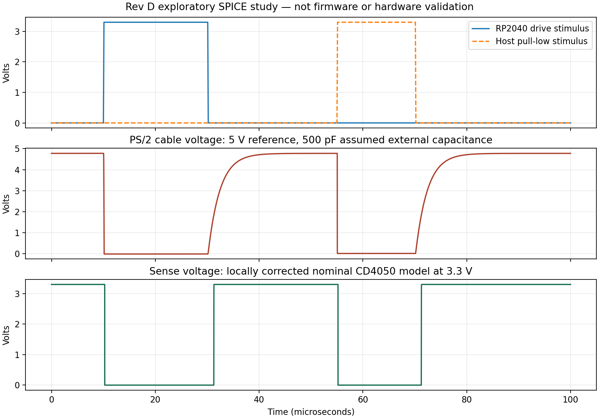

# Rev D exploratory simulation

**Simulation supports the intended PS/2 switching behavior under the listed
assumptions. It does not establish that the complete adapter works or is
ready to order.** The physical circuit and firmware pin assignments have
not changed as a result of this study.



## What was run

ngspice 42 ran the four PS/2 drive/sense circuits using resistor values and
pin assignments checked against `../circuit.json`. Each circuit was tested
with three paired supply settings and three assumed external capacitances:

- Target reference / module logic supply: 4.75 / 3.135 V, 5.0 / 3.3 V,
  and 5.25 / 3.465 V. These are three scenarios, not all independent corners.
- External cable/connector/probe capacitance: 100, 500 and 1000 pF.
- Temperature: 25°C. Resistors use nominal values, without tolerance sweeps.
- GPIO drive is a voltage stimulus with an assumed 30 Ω source resistance.
- Host inhibit is an ideal low-side switch with 10 Ω on resistance.
  No X16 host pull-up or motherboard model is included.
- A locally adapted CD4050 behavioral model drives an assumed 10 pF GPIO load.

The test asserts the adapter transistor, releases it, and then makes the
host pull the line LOW while the adapter releases it. It is not a PS/2
packet generator, USB transaction test, or firmware execution environment.
The four channels share the same topology, so their numerical results
repeat; the channel checks verify their resistor and pin mappings too.

## Results and their meaning

All **36 exploratory cases** met the stated static voltage checks:
released cable above 4 V, asserted cable between −0.05 and 0.4 V, and
sense output close to the modeled 3.3 V-domain rails.

| Quantity | Result under the modeled assumptions |
|---|---|
| Lowest released cable HIGH | 4.537 V |
| Highest host-held LOW | 0.011 V |
| GPIO drive current | 1.108–1.254 mA |
| Cable 10–90% release rise time | 1.054–9.931 µs |
| Nominal 5 V / 500 pF release rise time | 4.999 µs |

The model predicts a **small negative transistor-driven LOW**, approximately
−14 to −15 mV. Treat that as a model limitation, not a physical voltage
prediction or a guaranteed saturation voltage. The deliberately broad LOW
check catches gross logic failures; it does not validate the model itself.

Higher assumed cable capacitance makes the released line rise more slowly.
Actual cable capacitance, host pull-ups and firmware sampling times must
be measured together before concluding that PS/2 timing is satisfactory.
The rise times above are measurements of the simulated cable node, not
guaranteed propagation times for the CD4050.

[Summary](summary.txt), [complete results CSV](results.csv),
[results and provenance JSON](results.json), and [nominal waveform data](waveform.txt)
are provided for review.

## Model provenance and corrections

The script downloads manufacturer models into a local cache and verifies
their SHA-256 hashes. The model libraries are not redistributed here.

- [onsemi 2N3904 model](https://www.onsemi.com/pub/Collateral/2N3904.LIB):
  used unchanged. It is a nominal model for that manufacturer's device,
  not a qualification of every transistor sold as 2N3904.
- [TI CD4050B model package](https://www.ti.com/lit/zip/schm018): the
  downloaded model incorrectly selects NAND behavior. TI acknowledges
  this error in its [support response](https://e2e.ti.com/support/logic-group/logic/f/logic-forum/1015038/cd4050b-issue-with-cd4050b-spice-model).
  The support attachment could not be downloaded in this environment.
  Our script makes an explicit **local** correction (`AND=1`, `NAND=0`)
  consistent with the [non-inverting datasheet function](https://www.ti.com/lit/ds/symlink/cd4050b.pdf).
  It also renames the model's `VT` parameter to avoid collision with
  ngspice's built-in thermal-voltage value. These are not claimed to be
  TI's own corrected attachment or a TI-validated ngspice model.

The script separately sanity-checks LOW and HIGH outputs after adapting the
model. This is necessary but insufficient to validate its analog accuracy.
The TI model's timing/output-resistance tables begin at 5 V; applying it
at 3.3 V does not qualify CD4050 timing, drive strength, temperature behavior,
or power consumption. Do not use it to approve power-off input tolerance.

## Reproduce

Use Python 3, NumPy, Matplotlib and ngspice with XSPICE/PSpice compatibility.
The first run downloads the two models; later runs verify the cached files.

```sh
python3 hardware/rev-d/simulation/run.py --ngspice ngspice
```

For a privately extracted ngspice installation, pass its executable with
`--ngspice` and its directory of `.cm` files with `--code-model-dir`.
`--cache` selects where manufacturer libraries are downloaded. The script
only changes the simulation outputs; it does not regenerate or edit CAD.

[ps2-example.cir](ps2-example.cir) is a portable nominal example. For manual
use, place the cached `2N3904.lib` and locally corrected `CD4050B-local.lib`
in a `models/` directory beside it and enable ngspice PSpice compatibility.
The full script handles those paths and the compatibility setting for you.

## What is still required before a PCB order

1. Implement and test USB enumeration and HID reports from the actual
   keyboard and mouse receivers, first separately and then simultaneously.
2. Implement PS/2 device firmware and test its host-command handling,
   acknowledgments, framing, clock inhibit and keyboard/mouse translation.
3. Breadboard the drive/sense interfaces and measure the actual voltages,
   signal edges and reset behavior using [the test-point map](../test-points.md).
4. Verify external power, receiver startup load and all PC USB/X16 power
   combinations. TPS2042 protection, regulator startup and backfeeding were
   **not simulated**. Do not substitute a TPS2042B model and assume it
   validates the TPS2042P fitted to this board.
5. Check the actual module and DIN sockets against a 1:1 print, then confirm
   USB signal integrity and operation with the intended X16 board/ROM.

Existing CAD clearance/connectivity reports remain useful, but they are
separate from this study. No extracted PCB parasitics, USB receiver model,
RP2040 firmware model or complete Commander X16 model was simulated.
